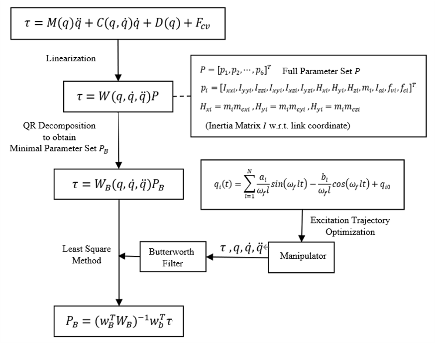

# Guidance:
Dynamic parameter identification code for rokae xmate manipulator based on MATLAB, including excitation trajectory optimization, LSM method, and N-E formulation of dynamic equation.

## Project Stucture and Description:
### Dynamics: 
- Formulate robot dynamic model through Newton-Euler method.
- Linearize robot dynamic model to obtain regressor.
- Apply QR decomposition to obtain minimal regressor.
- Convert minimal parameter set Pmin to standard set.
- Verify error between observation and NE-based estimation. 
- Deduce robot dynamic equation item.  

See `./dynamics/README.md` and `run_dynamics.m` for details. 

### Excitation:
- optimize excitation trajectory based on cond of minimal regressor.
- matrixized constraints for trajectory optimization:
|q| < qmax, |qd| < qdmax, |qdd| < qddmax, q0=qn=q_init
- plot figures of {q, qd, qdd, cart_pos} and also animation.
- cpp scripts for running excitation trajectory based on rci client.  

See `./excitation/README.md` and `run_optimize.m` for details.

### Filtering:
- Downsample observation data to assigned size.
- Apply butterworth and zero-phase filter to q, qd, qdd, tau data.
- Plot figures of raw and filtered data.  

See `./filtering/README.md` and `run_filtering.m` for details.

### Identify:
- Apply LSE (least square estimation) to figure out minimal param set.
- Verify error between observation and estimation by min regressor.  

See `./identify/README.md` and `run_identify.m` for details.

## Usage scenarios:
* Identification pipeline:

  

* Excitation Trajectory Optimization:
  obtain min regressor matrix in `\dynamics` and then turn to `\excitation`
* Validation Error Verification:
  copy raw sensor data in `\filtering` and then turn to `\dynamics`